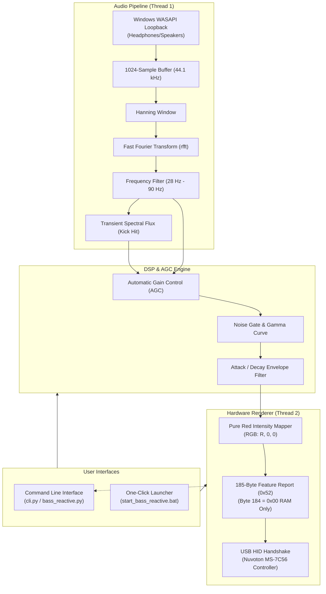

# System Architecture

This document describes the software architecture, data flow, and threading model for the **MSI MPG B550 GAMING PLUS (MS-7C56)** RGB Controller and Audio Visualizer.

---

## 1. High-Level Architecture



---

## 2. Directory & Module Breakdown

```text
fanrgbmpgb550/
├── docs/                      # Technical documentation
│   ├── ARCHITECTURE.md        # System design & data flow
│   ├── HARDWARE_PROTOCOL.md   # MSI 185-byte HID packet spec
│   ├── AUDIO_VISUALIZER.md    # Audio DSP & beat detection
│   └── CLI_GUIDE.md           # User guide for CLI & batch runners
├── src/                       # Core application source code
│   ├── config.py              # Constants, zone offsets, presets
│   ├── controller.py          # MSIMysticLightB550 hardware driver
│   └── visualizer.py          # BassVisualizer multi-threaded engine
├── tests/                     # Hardware diagnostics
│   ├── run_test.py            # Device detection & verification
│   ├── test_enum.py           # USB HID enumeration
│   └── test_read.py           # Feature report reader
├── cli.py                     # Terminal command-line tool
├── bass_reactive.py           # Quick CLI bass visualizer runner
├── start_bass_reactive.bat    # Windows double-click runner
├── msi_b550.py                # Backward-compatibility module
├── requirements.txt           # Python dependencies
└── README.md                  # Project overview
```

---

## 3. Threading Model

The application uses an asynchronous, decoupled multi-threading model to ensure zero audio drift, stutter-free lighting updates, and rock-solid stability:

1. **Audio Capture Worker (`_audio_worker`)**:
   * Runs in a background daemon thread.
   * Pulls 1024-frame chunks from Windows WASAPI loopback every ~23.2 ms.
   * Computes FFT and updates atomic shared variables (`_latest_bass`, `_latest_flux`).
   * Never waits for hardware updates, preventing audio buffer overflows.

2. **Render Worker (`_render_worker`)**:
   * Runs in a separate background daemon thread.
   * Regulates frame timing to ~32 FPS (~31 ms per cycle).
   * Pulls the freshest audio values, computes AGC, formats the 185-byte HID packet, and executes the two-packet USB handshake.
   * Emits telemetry metrics (`level`, `red_val`, `fps`) via a thread-safe callback to the console VU meter.

---

## 4. Hardware Safety & Flash Protection

MSI motherboards store permanent lighting configuration in an onboard EEPROM/Flash chip. Continuous writing to flash will degrade or permanently corrupt the microcontroller.

The controller strictly enforces **volatile RAM-only updates**:

```python
# Byte 184 of Feature Report 0x52 is the Save flag:
# 0x01 = Write to EEPROM (DANGEROUS if repeated)
# 0x00 = Volatile RAM update only (SAFE for continuous streaming)
packet[SAVE_OFFSET] = 0x00
```

Every method in `MSIMysticLightB550` guarantees `packet[184] = 0x00`. Real-time visualizers can run 24/7 without degrading motherboard hardware.
