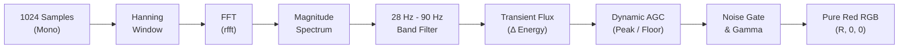

# Audio Visualizer & DSP Engine

This document explains the real-time audio capture, digital signal processing (DSP), frequency filtering, and beat-detection algorithms implemented in [`src/visualizer.py`](file:///E:/NAN/Github/fanrgbmpgb550/src/visualizer.py).

---

## 1. Audio Loopback Capture

Windows provides the **Windows Audio Session API (WASAPI)** loopback mechanism, allowing an application to capture exactly what is currently being rendered to an output device (headphones, speakers, or DAC) without requiring a physical microphone or virtual cable.

The visualizer uses the `soundcard` library to open a WASAPI loopback stream:
* **Sample Rate**: $44,100\text{ Hz}$
* **Block Size**: $1024\text{ frames}$ ($\approx 23.2\text{ ms}$ per audio chunk)
* **Channels**: Stereo converted to mono via average: $M = \frac{L + R}{2}$

---

## 2. DSP Pipeline & Frequency Filtering

### Why 28 Hz – 90 Hz?
Most music visualizers trigger on generic audio volume, causing unwanted flickering from vocals, guitars, synth leads, and percussion.

* **Male vocal fundamentals** begin around $85\text{ Hz} - 120\text{ Hz}$.
* **Snare drum bodies** resonate between $150\text{ Hz} - 250\text{ Hz}$.
* **Kick drums and 808 sub-bass** punch strictly in the **$30\text{ Hz} - 80\text{ Hz}$** region.

By restricting the frequency window strictly to **$28\text{ Hz} - 90\text{ Hz}$**, speech, vocals, and mid-range instruments are completely rejected.

---

## 3. Transient Beat Detection (Spectral Flux)

To prevent sustained bass notes or drone synths from pinning the lights at full brightness, the engine computes the **positive spectral flux**:

$$\text{Flux}_t = \max(0, \text{Bass}_t - \text{Bass}_{t-1})$$

When a kick drum strikes, there is an instantaneous positive spike in energy ($\text{Flux} \gg 0$). On sustained basslines or non-kick frames, $\text{Flux} = 0$, producing sharp, explosive beat hits that snap down cleanly.

---

## 4. Dynamic Automatic Gain Control (AGC)

Songs are mastered at vastly different loudness levels. A fixed threshold would cause quiet songs to never trigger and loud songs to stay pinned at 100%.

The engine maintains a continuous **peak and floor follower**:

* **Peak Decay**: Decays slowly over $\approx 1.5\text{ seconds}$ ($\text{Peak} \times 0.985$ per frame)
* **Floor Tracking**: Tracks background room noise and low rumble
* **Normalized Metric**:
  $$\text{Normalized} = \frac{\text{Energy} - \text{Floor}}{\text{Peak} - \text{Floor}}$$

---

## 5. Envelope & Gamma Shaping

1. **Noise Gate**:
   If $\text{Normalized} < \text{Threshold}$, value is clamped to $0.0$. This guarantees total darkness between beats.
2. **Gamma Power Curve**:
   $$\text{Shaped} = \text{Normalized}^{\gamma} \quad (\gamma \approx 1.6)$$
   Suppresses low-level rumble and dramatically accentuates kick impacts.
3. **Attack & Decay**:
   * **Attack (Immediate)**: When a new beat strikes, intensity jumps instantaneously:
     $$\text{Level}_t = \text{Level}_{t-1} \times 0.12 + \text{Target} \times 0.88$$
   * **Decay (Exponential)**: When the beat passes, light fades smoothly:
     $$\text{Level}_t = \text{Level}_{t-1} \times \text{Decay} \quad (\text{Decay} \approx 0.70)$$

---

## 6. Pure Red Color Mapping

To ensure **zero orange and zero amber**, the green and blue channels are mathematically locked to zero:

$$\text{Red} = \text{MinBrightness} + (255 - \text{MinBrightness}) \times \text{Level}$$
$$\text{Green} = 0$$
$$\text{Blue} = 0$$

* Quiet / Silence $\rightarrow$ Pitch black (`RGB: 0, 0, 0`) or subtle resting glow
* Low Bass $\rightarrow$ Soft dim red pulse (`RGB: 25, 0, 0`)
* Heavy Kick / Drop $\rightarrow$ Blazing pure red (`RGB: 255, 0, 0`)

---

## 7. Tuning Guide

| Parameter | Default | Recommended Range | Description |
| :--- | :---: | :---: | :--- |
| `--sensitivity` | `1.0` | `0.5 - 2.5` | Bass detection gain multiplier |
| `--decay` | `0.70` | `0.45 - 0.85` | Lower = snappier, strobe-like kicks; Higher = longer glow |
| `--threshold` | `0.18` | `0.10 - 0.35` | Noise gate to eliminate background hum |
| `--min-brightness` | `0` | `0 - 30` | Resting red level between beats (0 = pitch black) |
| `--gamma` | `1.6` | `1.2 - 2.2` | Contrast curve exponent |
| `--mode` | `hybrid` | `hybrid, kick, rumble` | Detection strategy |
