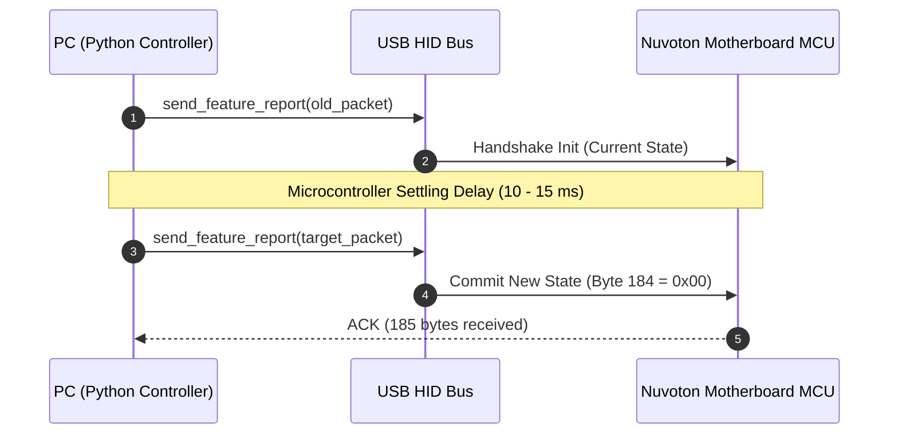

# Hardware & USB Protocol Specification

This document details the USB HID protocol, packet layouts, zone offsets, and handshake timing for the **MSI MPG B550 GAMING PLUS (MS-7C56)** RGB controller.

---

## 1. Device Identification

| Parameter | Value | Details |
| :--- | :--- | :--- |
| **Vendor ID (VID)** | `0x1462` | Micro-Star International Co., Ltd. (MSI) |
| **Product ID (PID)** | `0x7C56` | MS-7C56 Motherboard (MPG B550 GAMING PLUS) |
| **Microcontroller** | Nuvoton | Onboard USB HID microcontroller |
| **HID Interface** | Usage Page `0xFF00`, Usage `0x0001` | Vendor-defined HID feature reports |

---

## 2. Feature Report 0x52 Structure

The motherboard's lighting state is controlled via a single **185-byte HID Feature Report**:
* **Byte 0**: Report ID (`0x52`)
* **Bytes 1–183**: Zone lighting configuration payload
* **Byte 184**: Save / Persistence flag

### Zone Memory Offsets Table

| Zone Identifier | Start Byte | Length | Description |
| :--- | :---: | :---: | :--- |
| `j_rgb_1` | 1 | 10 bytes | 12V 4-pin RGB header |
| `j_pipe_1` | 11 | 10 bytes | Heatpipe LED 1 (if equipped) |
| `j_pipe_2` | 21 | 10 bytes | Heatpipe LED 2 (if equipped) |
| `j_rainbow_1` | 31 | 11 bytes | 5V 3-pin ARGB header 1 (up to 120 LEDs) |
| `j_rainbow_2` | 42 | 11 bytes | 5V 3-pin ARGB header 2 (up to 120 LEDs) |
| `j_corsair` | 53 | 11 bytes | Corsair proprietary ARGB header |
| `j_corsair_outer` | 64 | 10 bytes | Corsair outer ring |
| `on_board_led` | 74 | 10 bytes | Master Onboard PCB LEDs |
| `on_board_led_1` | 84 | 10 bytes | Individual Onboard LED 1 |
| `on_board_led_2` | 94 | 10 bytes | Individual Onboard LED 2 |
| `on_board_led_3` | 104 | 10 bytes | Individual Onboard LED 3 |
| `on_board_led_4` | 114 | 10 bytes | Individual Onboard LED 4 |
| `on_board_led_5` | 124 | 10 bytes | Individual Onboard LED 5 |
| `on_board_led_6` | 134 | 10 bytes | Individual Onboard LED 6 |
| `on_board_led_7` | 144 | 10 bytes | Individual Onboard LED 7 |
| `on_board_led_8` | 154 | 10 bytes | Individual Onboard LED 8 |
| `on_board_led_9` | 164 | 10 bytes | Individual Onboard LED 9 |
| `j_rgb_2` | 174 | 10 bytes | 12V 4-pin RGB header 2 |
| **`SAVE_OFFSET`** | **184** | **1 byte** | **Flash write flag (0x00=RAM, 0x01=EEPROM)** |

---

## 3. Zone Payload Layout (10 or 11 Bytes)

Each zone segment inside the 185-byte packet is structured as follows:

```text
Offset + 0: Mode / Effect ID (0 = Disable, 1 = Static, 2 = Breathing, 25 = Rainbow Wave, etc.)
Offset + 1: Primary RED (0 - 255)
Offset + 2: Primary GREEN (0 - 255)
Offset + 3: Primary BLUE (0 - 255)
Offset + 4: Combined Speed & Brightness byte:
            Bits [1:0] = Speed (0 = Low, 1 = Medium, 2 = High)
            Bits [6:2] = Brightness (0 = Off, 1 = 10%, 5 = 50%, 10 = 100%)
Offset + 5: Secondary RED (0 - 255)
Offset + 6: Secondary GREEN (0 - 255)
Offset + 7: Secondary BLUE (0 - 255)
Offset + 8: Flags byte:
            Bit 7 (0x80) = Custom RGB Color Enable
            Bit 0 (0x01) = SYNC_SETTING_ONBOARD (Required for master onboard zone)
Offset + 9: Reserved / Padding (0x00)
Offset + 10: LED Count / Cycle speed (Rainbow ARGB headers only)
```

---

## 4. The Two-Packet Update Handshake

The Nuvoton microcontroller firmware enforces a strict two-packet sequence to commit lighting transitions:



### Why the Handshake is Required
* Single packets sent without the preceding handshake are ignored by the firmware.
* An inter-packet delay of **10–12 ms** must be maintained; shorter intervals can lead to buffer overflows in the MCU.

---

## 5. Supported Hardware Modes

| Mode Name | Mode ID | Description |
| :--- | :---: | :--- |
| `MODE_DISABLE` | 0 | All LEDs completely powered off |
| `MODE_STATIC` | 1 | Solid color across all zones |
| `MODE_BREATHING` | 2 | Smooth fade in and out |
| `MODE_FLASHING` | 3 | Sharp intermittent flash |
| `MODE_DOUBLE_FLASHING` | 4 | Double strobe pulse |
| `MODE_LIGHTNING` | 5 | Crackling electrical storm effect |
| `MODE_METEOR` | 7 | Shooting meteor trail along ARGB headers |
| `MODE_COLOR_PULSE` | 21 | Rhythmic color pulse |
| `MODE_COLOR_SHIFT` | 22 | Continuous spectrum color cycling |
| `MODE_COLOR_WAVE` | 23 | Animated wave across zones |
| `MODE_MARQUEE` | 24 | Sequential chase animation |
| `MODE_RAINBOW_WAVE` | 25 | Full-spectrum rainbow wave animation |
| `MODE_VISOR` | 27 | Back-and-forth scanner effect |
| `MODE_STACK` | 36 | LEDs stack progressively |
| `MODE_FIRE` | 38 | Flickering flame simulation |
